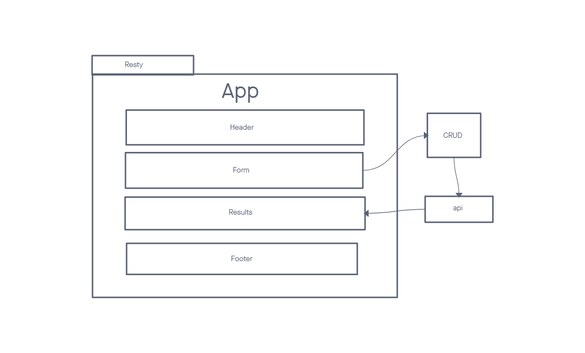
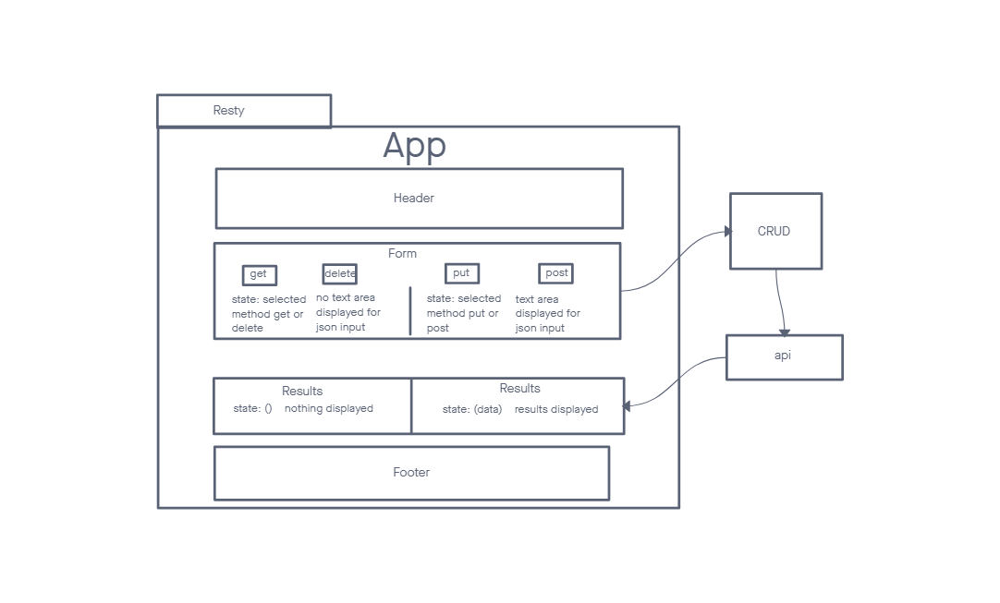
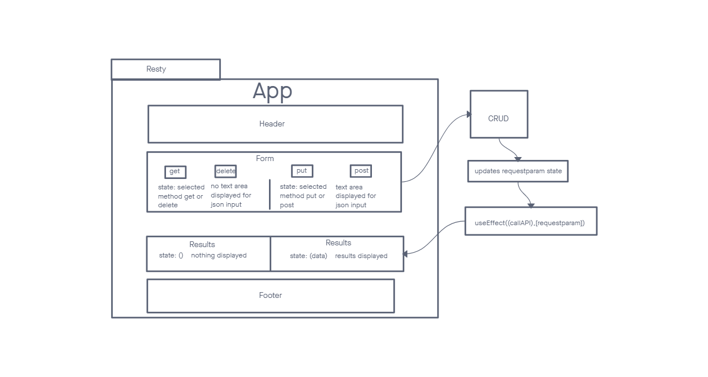
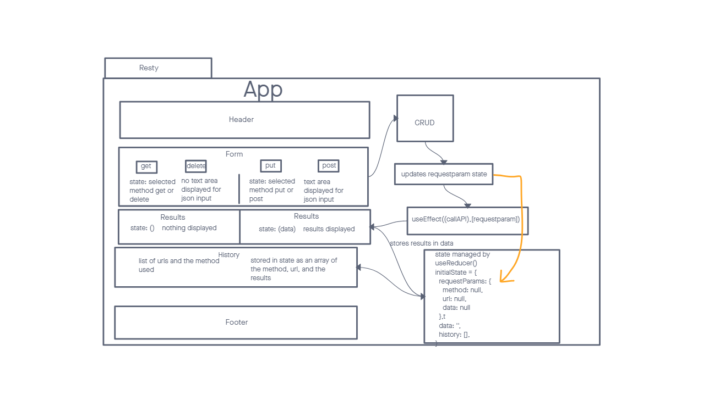

# LAB - Class 26

## Project: Resty

### Author: Seth Pierce

- [gitub link](https://github.com/sethppierce/resty)
- [prod deployment](https://singular-chimera-7750b1.netlify.app/)

### Problem Domain

Build a React App that takes in an api and shows how results are returned.

### Links and Resources

- [prod deployment](https://codesandbox.io/p/github/sethppierce/resty/draft/staging-dawn?file=%2F.gitignore&workspace=%257B%2522activeFileId%2522%253A%2522clcfgqh50000q7pfp7p5d3z9z%2522%252C%2522openFiles%2522%253A%255B%2522%252FREADME.md%2522%255D%252C%2522sidebarPanel%2522%253A%2522EXPLORER%2522%252C%2522gitSidebarPanel%2522%253A%2522COMMIT%2522%252C%2522spaces%2522%253A%257B%2522clcfgqj91001d356gls8yk86c%2522%253A%257B%2522key%2522%253A%2522clcfgqj91001d356gls8yk86c%2522%252C%2522name%2522%253A%2522Default%2522%252C%2522devtools%2522%253A%255B%257B%2522key%2522%253A%2522clcfgqj92001e356gvfmx4fx7%2522%252C%2522type%2522%253A%2522PROJECT_SETUP%2522%252C%2522isMinimized%2522%253Afalse%257D%252C%257B%2522type%2522%253A%2522PREVIEW%2522%252C%2522taskId%2522%253A%2522start%2522%252C%2522port%2522%253A3000%252C%2522key%2522%253A%2522clcfgr3do00fs356gcountc1e%2522%252C%2522isMinimized%2522%253Afalse%257D%252C%257B%2522type%2522%253A%2522TASK_LOG%2522%252C%2522taskId%2522%253A%2522start%2522%252C%2522key%2522%253A%2522clcfgr01i00c5356gpabqhalt%2522%252C%2522isMinimized%2522%253Afalse%257D%255D%257D%257D%252C%2522currentSpace%2522%253A%2522clcfgqj91001d356gls8yk86c%2522%252C%2522spacesOrder%2522%253A%255B%2522clcfgqj91001d356gls8yk86c%2522%255D%257D) (when applicable)

### Setup

#### How to initialize/run your application (where applicable)

- npm i
- npm start

#### Features / Routes

- Form input takes in an api and displays results in the format that they would be returned in a call to the api.
- text area that converts input into valid json for post and put requests.
- history of previous api calls, methods, and results

#### Tests

- npm test
- form
  - tests to see if textarea is rendered depending on which CRUD method is selected
- results
  - tests to see if results are displayed if data is not there or data is present.
- app
  - mocks api call and tests to see if test api results are displayed within the results component
  - mocks api call and tests to see if loading is displayed in results component while results from the api are still loading.
- reducer
  - tests reducer cases to see if inserting correctly into state

### UML

#### Phase 1 UML

#### Phase 2 UML

#### Phase 3 UML

#### Phase 4 UML

